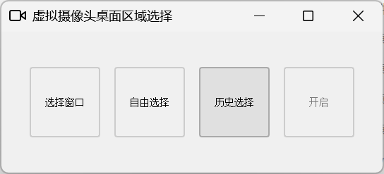
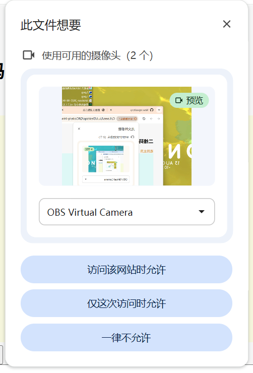

# v-camer 虚拟摄像头

一个基于PyQt5和pyvirtualcam的虚拟摄像头应用，支持屏幕区域选择和虚拟摄像头输出。

## 功能特点
- 直观的屏幕区域选择界面
- 支持窗口选择和自由区域选择两种模式
- 实时预览所选区域
- 虚拟摄像头输出

## 安装方法

1. 克隆或下载项目到本地
2. 安装依赖包：
   ```
   pip install -r requirements.txt
   ```

## 使用步骤
1. 运行主程序：
   ```
   python main.py
   ```
2. 在界面中选择需要捕获的屏幕区域
3. 点击"启动虚拟摄像头"按钮
4. 在视频会议软件中选择虚拟摄像头作为摄像头源

## 程序截图



## 注意事项
- Windows系统自带虚拟摄像头驱动，其他操作系统可能需要额外配置
- 目前仅在Chrome浏览器中测试过摄像头调用功能，其他应用程序的兼容性未经验证
- 若系统中安装了OBS软件，虚拟摄像头可能会显示为"OBS Virtual Camera"，请在视频会议软件中选择相应名称的摄像头源

## 依赖项
- PyQt5: GUI界面
- pyvirtualcam: 虚拟摄像头功能
- opencv-python: 图像处理
- numpy: 数组操作
- mss: 屏幕捕获
- pywin32: Windows系统API访问

## 开源协议
本项目遵循 MIT License，欢迎二次开发与贡献。